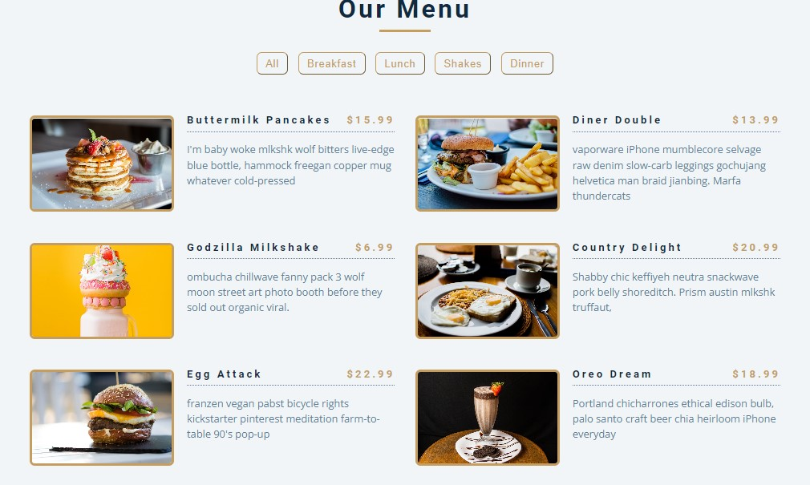

## Menu DOM !  🍽️
 

##  Uma aplicação simples, quem tem como funcionalidades filtrar as comidas, usando conceitos DOM. 💻 📚
 

## Tecnologias que utilizei para o projeto ;  

 
    
    
    

 

## Projeto 🥰

### [Menu DOM](https://alisson-aguiars2k.github.io/menu-dom/) 🔗